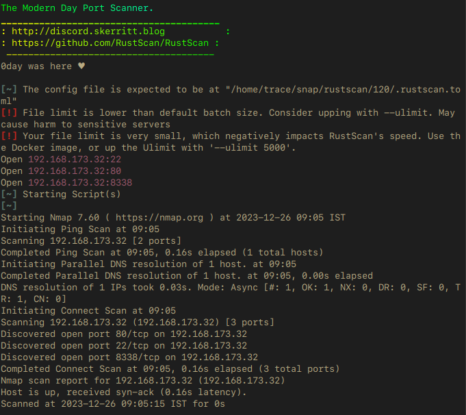

---

title: CTF-200-01 (OffSec. Proving Grounds) / Intermediate
image: /assets/writeups/trace5.jpg
description: Write-up of CTF-200-01 Machine
date: 2023-12-26 09:00:00 -3000
categories: [proving grounds]
tags: [maltrail, command injection, linux]
author: trace

---

# Enumeration



#### Port 80

Just a default apache page. Tried `dirb` and nothing much.


#### Port 8338

Running maltrail v0.52, Googling for a bit and i was able to find the exploit for the maltrail uptil version v0.53


[Maltrail POC](https://github.com/SethJGibson/Hummingbird-Maltrail-RCE-PoC/blob/main/hummingbird.py)


## Getting User

Now, we run the poc and get the User Shell,


And now we upgrade the shell and run linpeas to find our way to privesc.


## Getting Root

There were quite a few methods to root the machine, i choose a simple command injection into `.sh` file which was running as root and we had write permission to it(Found in LinPEAS.sh result).


```bash
echo "chmod u+s /bin/bash" >> /var/backups/etc_Backup.sh
```


And after couple of seconds we can just do,

```bash
/bin/bash -p
```


And we get root